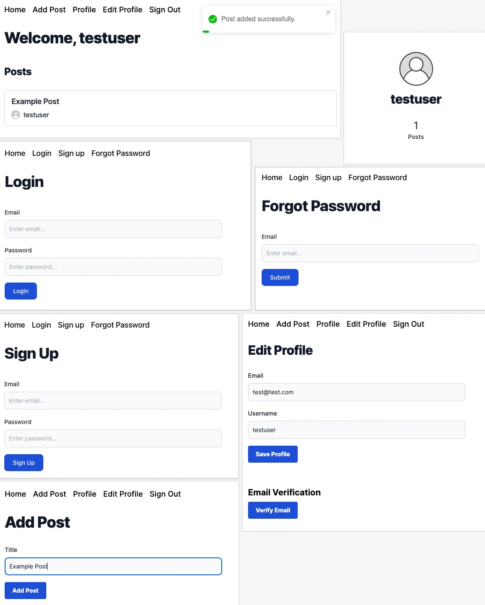

# Firebase Auth JWT - Next - Prisma - tRPC

- [x] Next
- [x] Prisma
- [x] tRPC
- [x] TypeScript
- [x] Firebase
- [x] Tailwind CSS / SASS
- [x] React Toastify

### Set Up

Install dependencies 
```
npm install
``` 

Run dev server 
```
npm run dev
``` 

Preview production build 
```
npm run build && npm run start
``` 

### Create `.env` from `.env.example` 

```
cp .env.example .env
```

### Firebase App Configuration

Replace variables with [firebase console](https://console.firebase.google.com/) app configuration values

`NEXT_PUBLIC_FB_API_KEY=''` 

`NEXT_PUBLIC_FB_AUTH_DOMAIN=''` 

`NEXT_PUBLIC_FB_PROJECT_ID=''` 

`NEXT_PUBLIC_FB_STORAGE_BUCKET=''` 

`NEXT_PUBLIC_FB_MESSAGING_SENDER_ID=''` 

`NEXT_PUBLIC_FB_APP_ID=''` 

### Firebase Admin SDK Configuration

`FIREBASE_SERVICE_ACCOUNT_KEY={}` 

[Remove line breaks](https://www.textfixer.com/tools/remove-line-breaks.php) from service account json

### Prisma Set Up 

Add database url to `.env.local`

`DATABASE_URL=''` 

```
npx prisma db push
```

### Roadmap 

- [x] Sign Up - `synced with prisma UserAccount model`
- [x] Login
- [x] Sign Out
- [x] Password Reset
- [x] Verify Email
- [x] Update Email + Profile - `synced with prisma UserAccount model`
- [x] Public Profile w/ Posts Count
- [x] Create Post
- [x] All Posts
    - [x] Infinite Scroll w/ Cursor Based Pagination

